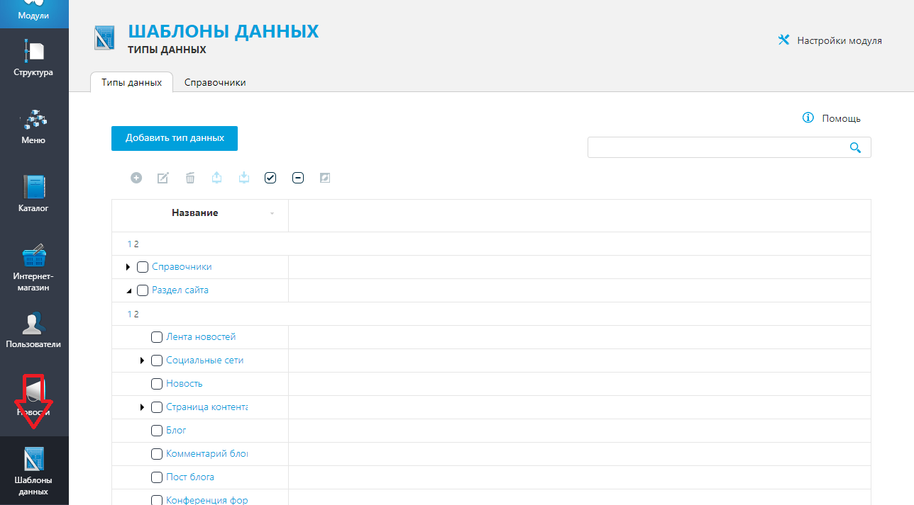

# Руководство пользователя
#### Чтобы выбрать при каких статусах отключить, а при каких включить синхронизацию с 1С, необходимо:  
1.  Зайти в админку сайта и перейти в модуль `Шаблоны данных`.  
  
2.  Во вкладке `Типы данных` ищем `Статус заказа`.  
  
3.  Выделяем данный справочник и кнопкой `Посмотреть` переходим в него.  
  
4.  Если в таблице нет столбца `Выгружать в 1С` Нажать на `+` и отметить данный пункт.  
  
5. Отметить варианты, когда нужно включить выгрузку.  
  