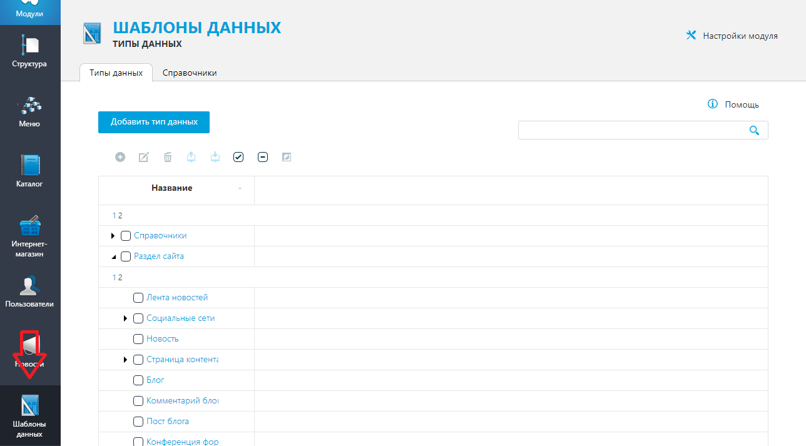
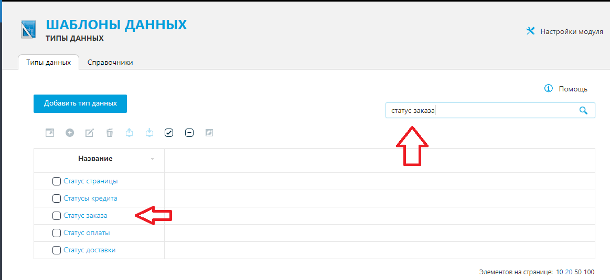
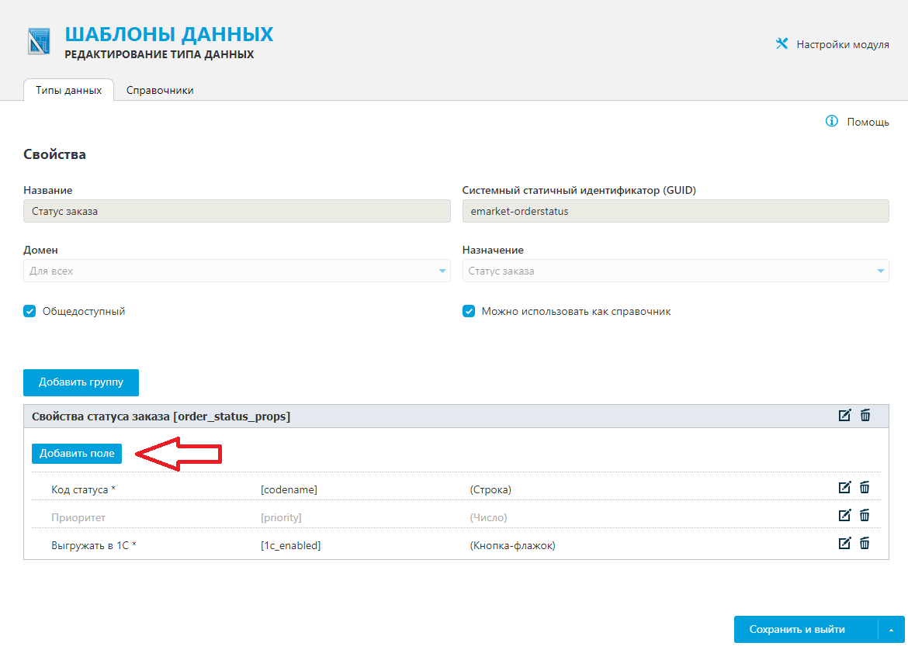
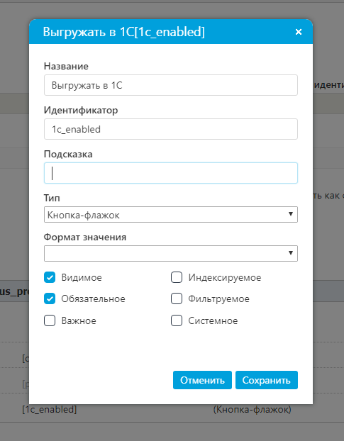

# EmarketDisable1cWhenNeed-UMI.CMS
Кастомный скрипт, добавляющий возможность контроллировать и отключать, в случае необходиости, выгрузку в 1С при смене статуса заказа.
___
## Описание вариантов внедрения.
1.  Основной вариант скрипта берет значение из специально созданного поля и, если получает `false`, отключает выгрузку в 1С для данного заказа.  
2.  Второй вариант (закомментированный) - позволяет жестко выбрать статусы для отключения/включения выгузки в 1С. Статусы заказов по умолчанию:
```
Отменен -> canceled
Отклонен -> rejected
Оплачивается -> payment
Доставляется -> delivery
Ожидает проверки -> waiting
Принят -> accepted
Готов -> ready
Редактируется -> editing
```
___
## Внедрение скрипта
### Если ранее файл `classes/components/emarket/customAdmin.php` не кастомизировался:
1.  Скопировать `classes/components/emarket/customAdmin.php`, заменив исходный.
2.  Выбрать нужный из двух вариант. Не нужный рекомендуется удалить из кода.
### Если файл ранее кастомизировался:
1.  Скопировать функцию `notifyOrderStatusChange`, в конец файла `classes/components/emarket/customAdmin.php`.
2.  Выбрать нужный из двух вариант. Не нужный рекомендуется удалить из кода.
## Создание справочника (только для гибкого варианта).
1.  Заходим в админку сайта, переходим в модуль `Шаблоны данных`.  
  
2.  Во вкладке `Типы данных` ищем `Статус заказа`.  
  
3.  Переходим в редактирование и в группе `Свойства статуса заказа` добавляем `Видимое`, `Обязательное` поле с идентификатором `1c_enabled`, тип - `Кнопка-флажок`.  
  
  
___
На этом разработка окончена и начинается администрирование.  
Продолжение - смотри [Руководство пользователя](HELP.md)